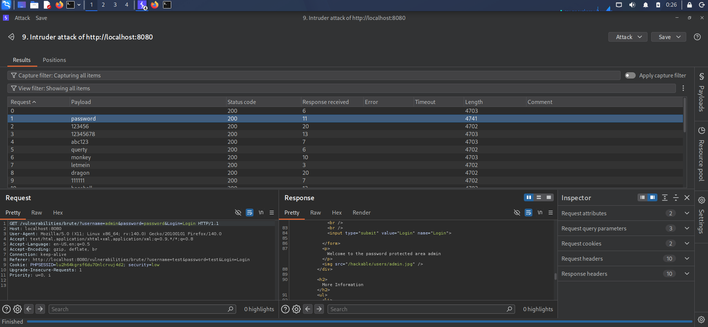
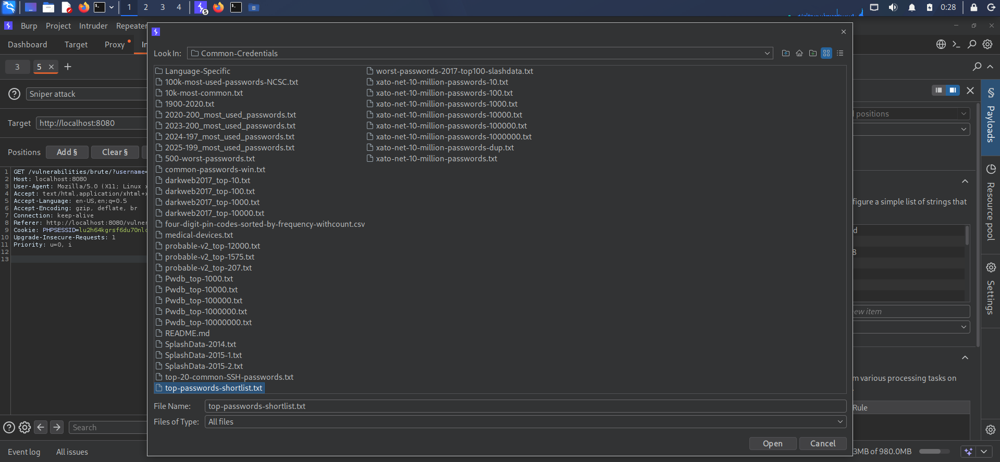
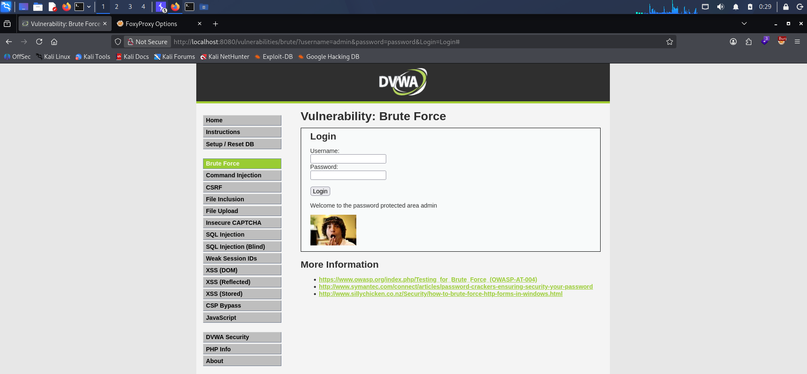

# DVWA Brute Force Attack - Low Security Level

## 📌 Vulnerability Metadata

| Field | Value |
| :--- | :--- |
| **Vulnerability Type** | Brute Force Attack / Improper Authentication |
| **Target Application** | Damn Vulnerable Web Application (DVWA) |
| **Target Endpoint** | `http://localhost:8080/vulnerabilities/brute/` |
| **Security Level** | Low |
| **Severity** | High |
| **CVSS v3.1 Score** | 7.5 (High) |
| **CVSS Vector** | `CVSS:3.1/AV:N/AC:L/PR:N/UI:N/S:U/C:H/I:N/A:N` |
| **Date of Testing** | September 23, 2026 |
| **Author** | Riyad Hasan |

---

## 📝 Executive Summary

The DVWA Brute Force module at the Low security level lacks essential protection mechanisms such as rate limiting, account lockout policies, or CAPTCHA challenges. This allows an attacker to perform a brute-force attack against the login form. By utilizing a common password wordlist, it is possible to systematically guess the administrator's password, leading to a complete compromise of the admin account.

---

## 🛠️ Tools & Environment

- **Attacker Machine:** Kali Linux (VM)
- **Target Machine:** DVWA running on Docker (localhost)
- **Proxy Tool:** Burp Suite Professional (Intruder module)
- **Wordlist:** `top-passwords-shortlist.txt` (SecLists)
- **Browser:** Firefox with FoxyProxy extension

---

## 🔑 Credentials Recovered

| Username | Password | Endpoint |
| :--- | :--- | :--- |
| `admin` | `password` | `http://localhost:8080/vulnerabilities/brute/` |

---

## 📋 Step-by-Step Reproduction

### Step 1: Environment Setup
1. Start the DVWA container: `docker start dvwa`
2. Navigate to `http://localhost:8080` and log in as `admin` / `password`.
3. Set the DVWA Security level to **Low** via the left menu (`DVWA Security` -> Submit).

### Step 2: Trigger and Capture the Request
4. Navigate to the **Brute Force** module.
5. Enter Username: `admin` and Password: `wrongpass`.
6. Click the **Login** button. The application will return "Username and/or password incorrect."
7. Open Burp Suite and navigate to **Proxy** -> **HTTP History**.
8. Locate the brute force request: `GET /vulnerabilities/brute/?username=admin&password=wrongpass&Login=Login`.

### Step 3: Configure Burp Intruder
9. Right-click the captured request and select **Send to Intruder**.
10. Go to the **Positions** tab and click **Clear §** to remove any default payload positions.
11. Highlight only the `wrongpass` value in the request query (`username=admin&password=§wrongpass§&Login=Login`) and click **Add §**.
12. Go to the **Payloads** tab. Select Payload type as **Simple list**.
13. Click **Load** and select the wordlist: `/usr/share/wordlists/seclists/Passwords/Common-Credentials/top-passwords-shortlist.txt`.

### Step 4: Execute the Attack
14. Click **Start Attack**.
15. Allow the Intruder to process the wordlist.
16. Once finished, click on the **Length** column header to sort the results by response size.
17. **Observation:** The majority of responses had a length of `4703` or `4702`. However, one specific request had a distinct length of `4741`.
18. Inspect the **Response** for the length `4741` request. It contained the string: `Welcome to the password protected area admin`.
19. The corresponding **Payload** for this request was `password`.

### Step 5: Verification
20. Log out of DVWA.
21. Log in using the recovered credentials: Username `admin`, Password `password`.
22. Access granted successfully.

---

## 📸 Evidence

### 1. Burp Intruder Attack Results

> **Analysis:** Out of all attempted passwords, only the payload `password` returned a response with a different length (`4741` instead of `4702`), indicating a successful login.

### 2. Wordlist Loaded in Burp Intruder

> **Analysis:** The SecLists wordlist `top-passwords-shortlist.txt` was loaded into Burp Intruder's Payloads section. This wordlist contains commonly used passwords and was used to fuzz the `password` parameter during the attack.

### 3. Verified Login to DVWA

> **Analysis:** Manual verification of the recovered credentials (`admin` / `password`) confirms the vulnerability. The admin panel was successfully accessed.

---

## 💥 Impact

Successful exploitation of this vulnerability allows a remote, unauthenticated attacker to:
- Gain unauthorized access to the administrative account.
- Compromise the entire web application and its underlying database.
- Exfiltrate sensitive user data, including personally identifiable information (PII).
- Potentially achieve Remote Code Execution (RCE) if the admin panel allows file uploads or plugin installations.
- Establish persistence and bypass security controls.

---

## 🛡️ Remediation & Mitigation

### Short-Term Mitigations
1. **Account Lockout Policy:** Lock the account temporarily (e.g., 15 minutes) after 3-5 consecutive failed login attempts.
2. **Rate Limiting:** Implement IP-based rate limiting to restrict the number of login requests per minute.
3. **CAPTCHA:** Integrate Google reCAPTCHA or hCaptcha on the login form to prevent automated tools.
4. **Progressive Delays:** Increase the response time exponentially with each failed login attempt (e.g., 1s, 2s, 4s, 8s).

### Long-Term Recommendations
5. **Strong Password Policy:** Enforce a minimum password length of 12 characters, including a mix of uppercase, lowercase, numbers, and symbols.
6. **Multi-Factor Authentication (MFA):** Implement TOTP or hardware token-based MFA for all administrative accounts.
7. **Monitoring & Alerting:** Configure SIEM (e.g., Splunk, Wazuh) to alert on multiple `401 Unauthorized` or `200 OK` login attempts from a single IP.
8. **Password Breach Detection:** Block passwords that have appeared in known data breaches using the HaveIBeenPwned API.

---

## 📚 References
- [OWASP: Brute Force Attack](https://owasp.org/www-community/attacks/Brute_force_attack)
- [OWASP Authentication Cheat Sheet](https://cheatsheetseries.owasp.org/cheatsheets/Authentication_Cheat_Sheet.html)
- [CWE-307: Improper Restriction of Excessive Authentication Attempts](https://cwe.mitre.org/data/definitions/307.html)
- [PortSwigger: Brute Force Attacks](https://portswigger.net/web-security/authentication/password-based)

---
*Disclaimer: This Proof of Concept was conducted in a controlled, isolated lab environment (DVWA) for educational and portfolio purposes only. No unauthorized systems were targeted.*
