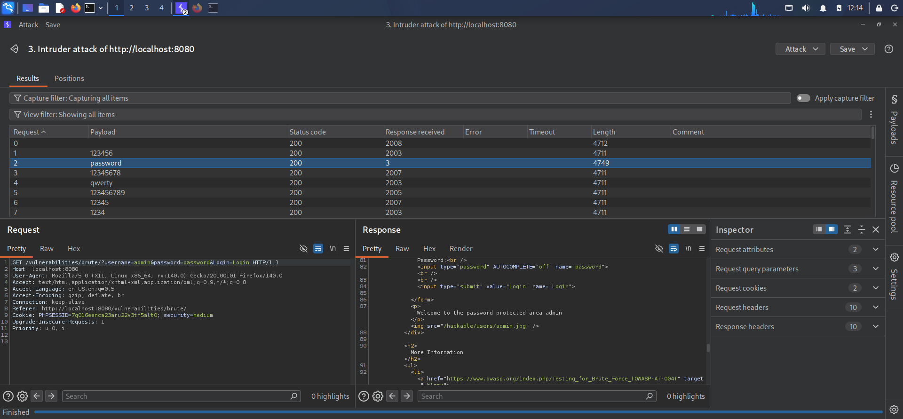
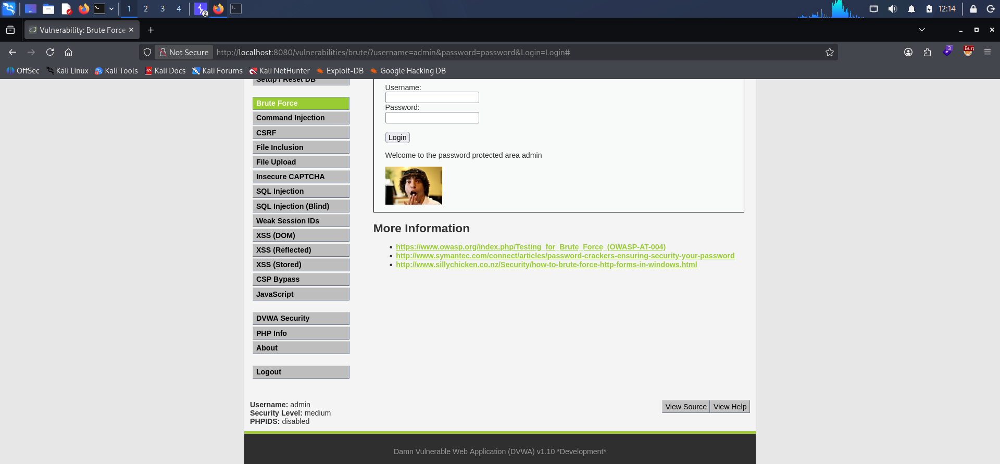

# DVWA Brute Force Attack — Medium Security Level

## 📌 Vulnerability Metadata

| Field | Value |
| :--- | :--- |
| **Vulnerability Type** | Brute Force Attack / Improper Authentication |
| **Target Application** | Damn Vulnerable Web Application (DVWA) |
| **Target Endpoint** | `http://localhost:8080/vulnerabilities/brute/` |
| **HTTP Method** | `GET` |
| **Security Level** | Medium |
| **Severity** | High |
| **CVSS v3.1 Score** | 7.5 (High) |
| **CVSS Vector** | `CVSS:3.1/AV:N/AC:L/PR:N/UI:N/S:U/C:H/I:N/A:N` |
| **Date of Testing** | September 24, 2026 |
| **Author** | Riyad Hasan |

---

## 📝 Executive Summary

At the Medium security level, DVWA introduces a server-side delay (`sleep(2)`) on failed login attempts as a mitigation against brute-force attacks. However, this delay creates a **timing side-channel** — the successful login returns instantly while failed attempts take ~2 seconds.

By using a small, targeted wordlist and Burp Intruder's Resource Pool, the administrator credentials were successfully recovered: **`admin` / `password`**.

---

## 🛠️ Tools & Environment

- **Attacker Machine:** Kali Linux (VM)
- **Target Machine:** DVWA on Docker (localhost:8080)
- **Proxy Tool:** Burp Suite Professional (Intruder)
- **Wordlist:** Custom `medium-passwords.txt` (48 common passwords)
- **Browser:** Firefox + FoxyProxy

---

## 🔑 Credentials Recovered

| Username | Password | Endpoint |
| :--- | :--- | :--- |
| `admin` | `password` | `http://localhost:8080/vulnerabilities/brute/` |

---

## 📋 Step-by-Step Reproduction

### Step 1: Setup
1. Start DVWA: `docker start dvwa`
2. Log in to `http://localhost:8080` as `admin` / `password`
3. Set **DVWA Security** → **Medium**

### Step 2: Observe the Delay
4. Navigate to **Brute Force**
5. Enter Username: `admin`, Password: `wrongpass` → Click Login
6. Notice the **~2 second delay** before the error message appears

### Step 3: Capture in Burp
7. Open Burp → **Proxy** → **HTTP History**
8. Locate the request: GET /vulnerabilities/brute/?username=admin&password=wrongpass&Login=Login

### Step 4: Configure Intruder
9. Right-click → **Send to Intruder**
10. **Positions** → **Clear §** → highlight only `wrongpass` → **Add §**
11. **Payloads** → Simple list → Load `medium-passwords.txt`

### Step 5: Configure Resource Pool (Critical)
12. Intruder → **Resource Pool** tab → **Create new resource pool**
13. Name: `SlowPool`, Max concurrent requests: `1`, Delay: `1 ms`
14. Click **OK**

### Step 6: Execute Attack
15. Click **Start Attack** (~96 seconds for 48 payloads)

### Step 7: Analyze Results
16. Sort by **Response received** column
17. **Key Observation:**
 - Failed logins: **~2003–2008 ms**, Length **4711**
 - Successful login: **3 ms**, Length **4749**, Payload **`password`**

### Step 8: Verify
18. Confirm the URL: http://localhost:8080/vulnerabilities/brute/?username=admin&password=password&Login=Login

19. Response: **"Welcome to the password protected area admin"**

---

## 📸 Evidence

### 1. Burp Intruder Attack Results

> **Analysis:** Failed attempts took ~2003–2008 ms with length 4711 (due to server-side `sleep(2)`). The successful payload `password` returned in just **3 ms** with length **4749** — a clear timing side-channel.

### 2. Verified Login to DVWA

> **Analysis:** Manual login with recovered credentials confirms the vulnerability.

---

## 💥 Impact

An unauthenticated attacker can:
- Bypass the delay-based mitigation via timing analysis
- Achieve admin account takeover
- Compromise the application and database
- Exfiltrate sensitive user data

---

## 🛡️ Remediation

### Short-Term
1. **Account Lockout** — Lock after 3–5 failed attempts
2. **Rate Limiting** — Restrict login attempts per IP
3. **CAPTCHA** — Add reCAPTCHA/hCaptcha
4. **Constant-Time Responses** — Never use `sleep()` based on user input

### Long-Term
5. **Strong Password Policy** — Minimum 12 characters with mixed types
6. **Multi-Factor Authentication (MFA)**
7. **Monitoring & Alerting** — SIEM alerts on failed login patterns
8. **Password Breach Detection** — HaveIBeenPwned API

---

## 📚 References
- [OWASP: Brute Force Attack](https://owasp.org/www-community/attacks/Brute_force_attack)
- [CWE-307: Improper Restriction of Excessive Authentication Attempts](https://cwe.mitre.org/data/definitions/307.html)
- [CWE-208: Observable Timing Discrepancy](https://cwe.mitre.org/data/definitions/208.html)

---
*Disclaimer: This PoC was conducted in an isolated lab environment (DVWA) for educational purposes only.*
